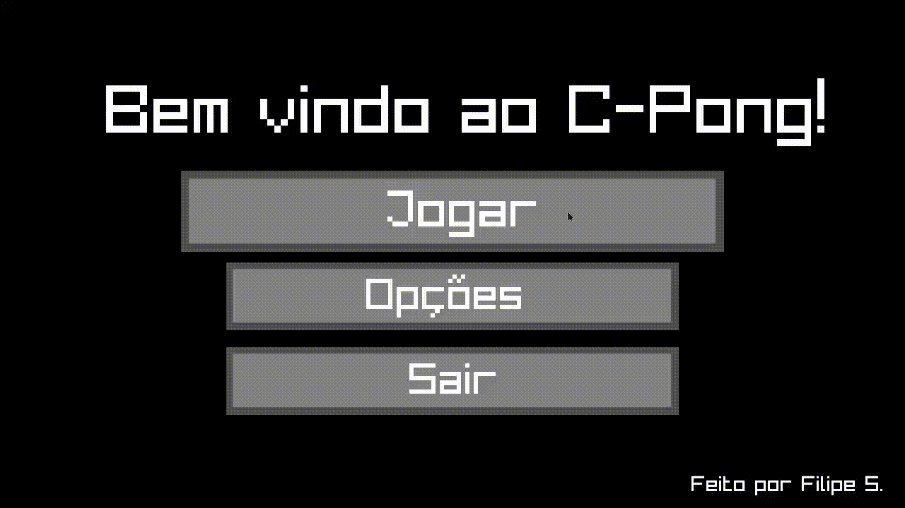

# 🏓 C-Pong

Uma recriação do clássico **Pong**, feita em **C** usando a biblioteca **Raylib**.
O projeto nasceu como forma de:

* 📚 Aprender mais sobre **linguagem C**
* 🎨 Explorar a **Raylib** para jogos 2D
* 🎮 E claro, recriar o lendário Pong por **diversão**

---

## ✨ Funcionalidades

* ⚡ Ajuste de velocidade da bola e das raquetes
* 🎨 Diferentes paletas de cores (visual personalizável)
* 🏆 Defina a pontuação máxima da partida
* 🖥️ Exibição de FPS e status opcionais
* 🔄 Menu de opções e tela de fim de jogo

---

## 🎥 Demonstração

Aqui vai um **GIF** mostrando o jogo rodando:

---

## 👾 Controles

* **Player 1:**

  * `W` = mover para cima
  * `S` = mover para baixo

* **Player 2:**

  * `↑` = mover para cima
  * `↓` = mover para baixo

---

## 🧑‍💻 Créditos

Feito por **Filipe S.**
Inspirado no clássico Pong (1972)
Usando a incrível biblioteca [Raylib](https://www.raylib.com/)
